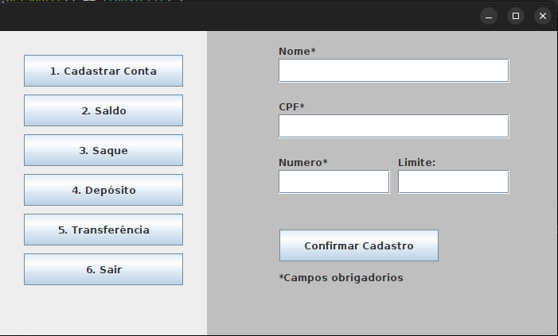

## Trabalho avaliativo LPOO

Se for utilizar no Vscode, favor instalar a extenção: Extension Pack for Java

## Estrutura de arquivos

Consiste em dois arquivos:

- `src`: arquivo para inserir os arquivos de codigo
- `lib`: arquivo para manter dependencias
- `bin`: arquivos compilados
